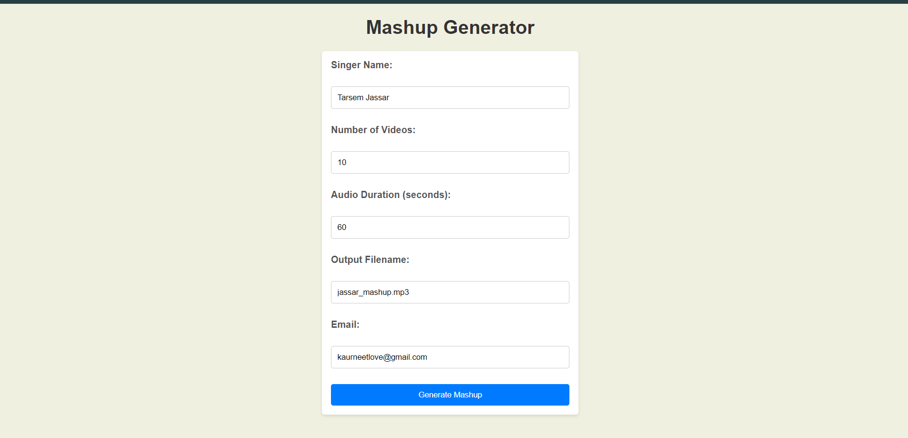
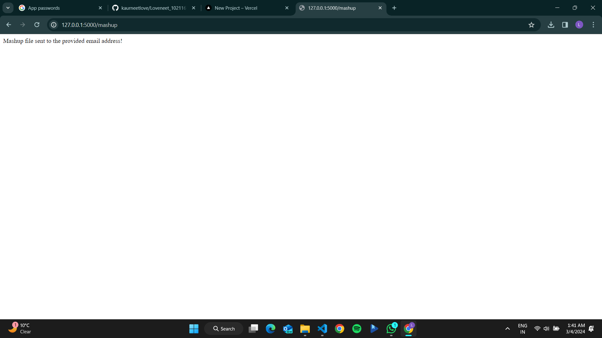

# Loveneet_102116111_Mashup

python code for Download N videos of X singer from “Youtube”  then Convert all the videos to audio and Cut first Y sec audios from all downloaded files. Merge all audios to make a single output file.

## FUNCTIONS

### 102116111.py
  - get_videos(singer_name, num_videos): Searches YouTube for videos of the specified singer and returns a list of video URLs.
  - download_video(video_url, save_path): Downloads the video from the provided URL and saves it to the specified path.
  - convert_to_mp3(video_title, save_path): Converts the downloaded video to MP3 format.
  - trim_mp3(mp3_path, duration): Trims the MP3 file to the specified duration.
  - download_and_process_video(video_url, save_path, duration): Downloads the video, converts it to MP3, and trims it.
  - merge_mp3s(singer_name, save_path, outputfilename): Merges all MP3 files generated into one mashup MP3 file.
  - mashup(singer_name, num_videos, duration, outputfilename): Coordinates the download, conversion, and merging of the videos.
  - main(): Entry point of the script that parses command-line arguments (singer name, number of videos, duration, output filename) and calls mashup() with those arguments.

## To run code
python 102116111.py singer_name num_videos duration outputfilename

### index.py

Flask application for above code that mails the audio file to input email id. 

